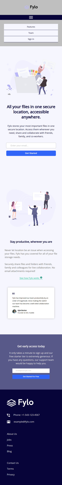

# Landing Page com layout resposinvo e menu hamburger

Esta é uma solução para o desafio do Frontend Mentor de uma página inicial de layout responsivo de duas colunas, em que desenvolvi uma Landing Page com algumas adaptações, incluindo um menu hamburger.

## Índice

- [Visão geral](#visão-geral)
  - [O desafio](#o-desafio)
  - [Captura de tela](#captura-de-tela)
  - [Links](#links)
- [Meu processo](#meu-processo)
  - [Tecnologias utilizadas](#tecnologias-utilizadas)
  - [O que aprendi](#o-que-aprendi)
  - [Status do projeto](#status-do-projeto)
  - [Recursos úteis](#useful-resources)
- [Autora](#autora)
- [Licença](#licença)

## Visão geral

### O desafio

Os usuários devem ser capazes de:

- Ver o layout ideal para o site, dependendo do tamanho da tela do dispositivo (375px/1440px)
- Ver os estados de foco para todos os elementos interativos na página

### Captura de tela




### Links

- URL da solução: [GitHub](https://github.com/adynaslima/Fylo-Landing-page-with-two-column-layout.git)
- URL do site: [Site](https://fylo-landing-page-with-two-column-layout-3gsp.vercel.app/)

## Meu processo

### Tecnologias utilizadas

- Marcação HTML5 semântica
- Propriedades personalizadas CSS
- Flexbox
- Fluxo de trabalho móvel primeiro
- JavaScript

### O que aprendi

```js
      <script>
        function clickMenu() {
          if (itens.style.display == 'block') {
            itens.style.display = 'none'
          } else {
            itens.style.display = 'block'
          }
        }
      </script>
```

### Status do projeto

Em construção...

### Recursos úteis

- [Vídeo sobre menu hamburger](https://www.youtube.com/watch?v=Dd6Z3gkud18&t=392s) - Esse vídeo me ajudou a desenvolver o menu hamburger. Recomendo a todos que estão iniciando JavaScript e desejam fazer alguma aplicação mais básica. 

## Autora

- GitHub - [Adyna Lima](https://github.com/adynaslima)
- LinkedIn - [Adyna Lima](https://www.linkedin.com/in/adynalima/)

## Licença

Este projeto está licenciado nos termos da licença MIT.
